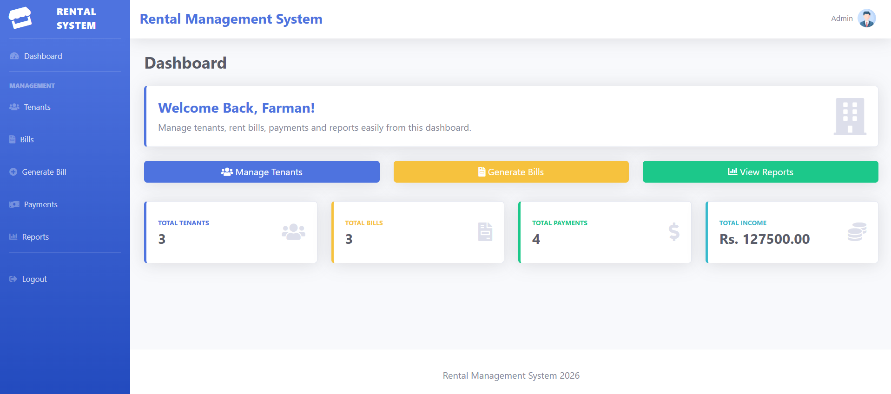
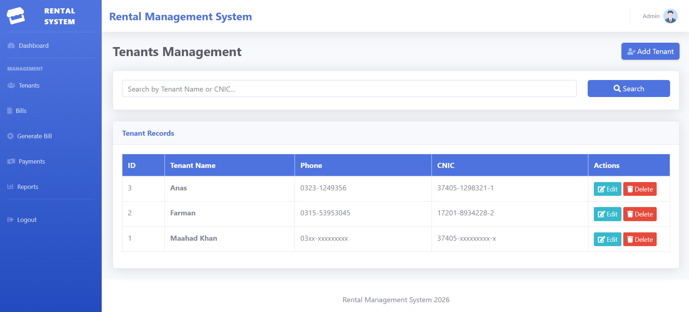
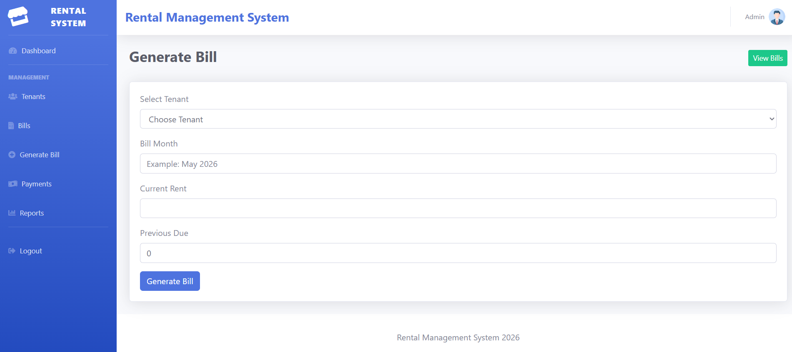
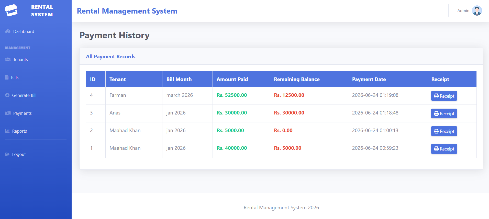

# Rental Management System

A web-based Rental Management System developed using PHP, MySQL, HTML, CSS, Bootstrap, and JavaScript.

## Features

- Admin registration and login
- Secure password hashing
- Tenant management
- Add, edit, delete, and search tenants
- Generate rent bills
- Track full and partial payments
- View payment history
- Generate receipts
- Reports dashboard
- Total income calculation
- Pending bill tracking

## Screenshots

### Login Page


### Dashboard



### Tenant Management



### Generate Bill



### Payment History



## Technologies Used

- PHP
- MySQL
- HTML
- CSS
- Bootstrap
- JavaScript
- SB Admin Dashboard Template

## Database

Database name:

```sql
rental_management
